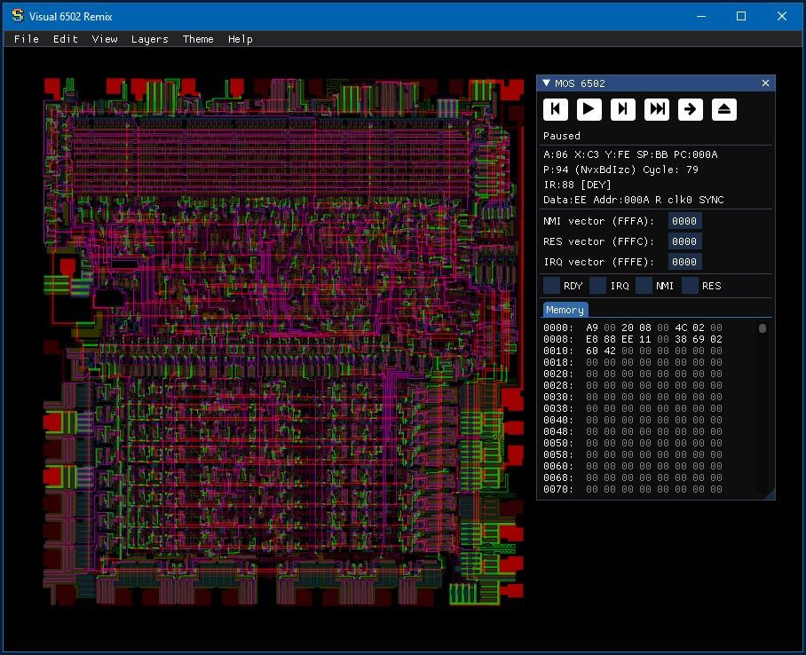
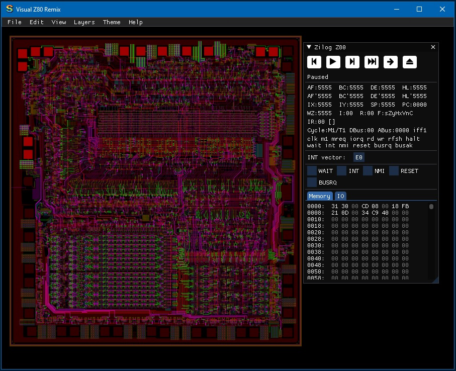
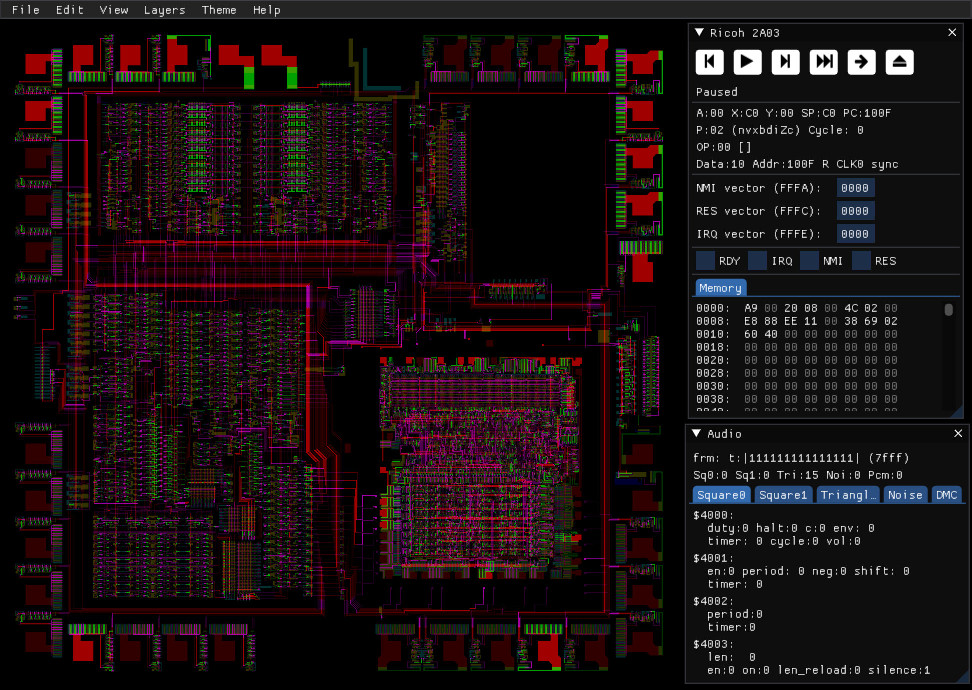
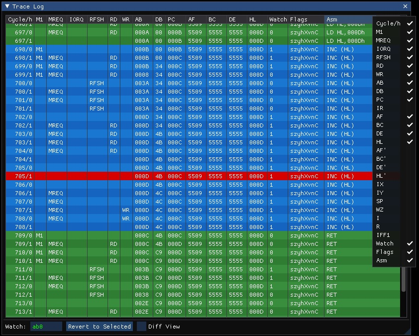
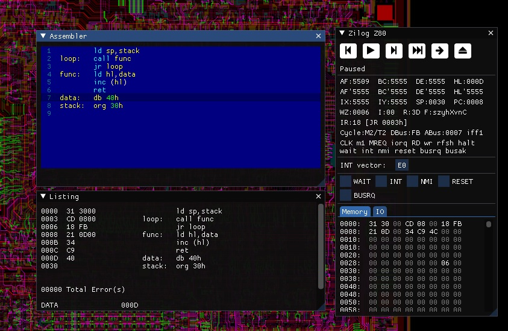
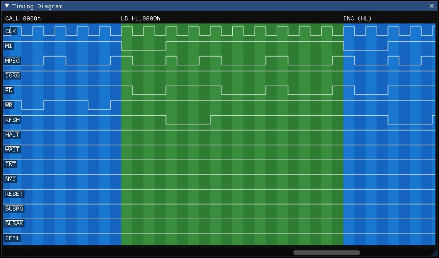
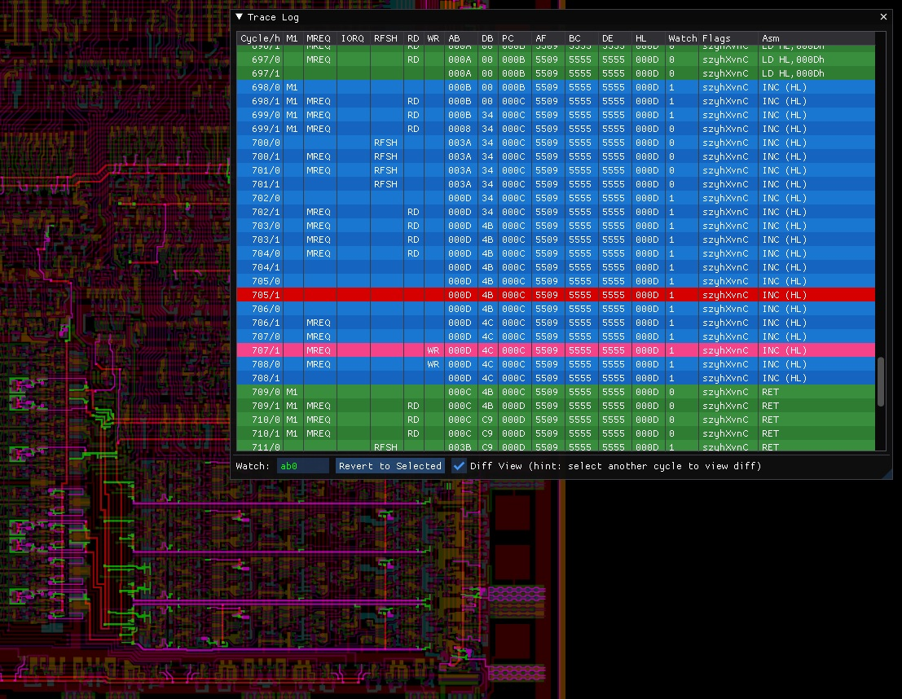
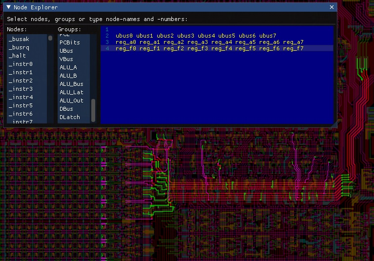
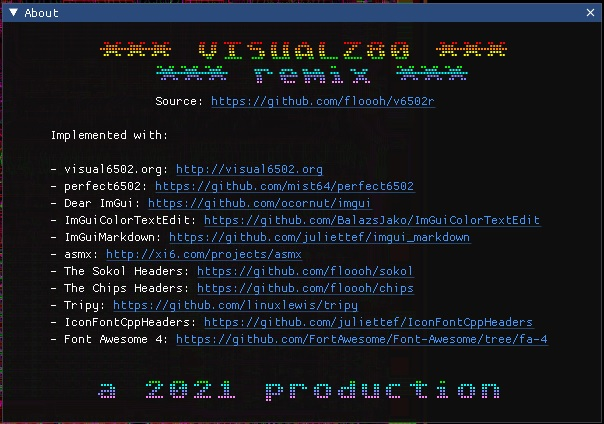

# v6502r

[](https://github.com/floooh/v6502r/actions/workflows/build.yml)

Visual6502 and VisualZ80 Remixed

WASM Version for 6502: https://floooh.github.io/visual6502remix/

...and for the Z80: https://floooh.github.io/visualz80remix/

TL;DR: Take the [visual6502](https://github.com/trebonian/visual6502) project
and turn it into a native+wasm app via
[perfect6502](https://github.com/mist64/perfect6502), [Dear
ImGui](https://github.com/ocornut/imgui/) and
[Sokol](https://github.com/floooh/sokol).

# Feature Gallery

6502 simulation:



Z80 simulation:



2A03 simulation:



Log CPU state and revert to a previous cycle:



Integrated assembler:



I/O pin timing diagram:



Visualize difference between two cycles:



Explore netlist nodes by their name, group or number:



...and a kickass About box ;)



## How To Build:

Install Deno:

https://docs.deno.com/runtime/getting_started/installation/

You'll also need cmake and your system's C/C++ toolchain.

To get an idea about additional required tools, first run

```
> ./fibs diag tools
```

To build and run the native version, run:

```
> ./fibs build
...
> ./fibs run v6502r
> ./fibs run vz80r
> ./fibs run v2a03r
```

Linux may require additional development packages for X11 and OpenGL development.

To build the WASM version:

```
> ./fibs emsdk setup
> ./fibs config emsc-ninja-release
> ./fibs build
> ./fibs run v6502r
> ./fibs run vz80r
> ./fibs run v2a03r
```

To develop the project in an IDE first run one of:

```
> ./fibs config win-vstudio-debug
> ./fibs config macos-xcode-debug
> ./fibs config win-vscode-debug
> ./fibs config macos-vscode-debug
> ./fibs config win-vscode-debug
```

...then open the project in Visual Studio, Xcode or VScode:

```
> ./fibs open
```

## Software used in this project:

Many thanks to:

- **visual6502**: https://github.com/trebonian/visual6502
- **perfect6502**: https://github.com/mist64/perfect6502
- **Dear ImGui**: https://github.com/ocornut/imgui/
- **ImGuiColorTextEdit**: https://github.com/BalazsJako/ImGuiColorTextEdit
- **ImGuiMarkdown**: https://github.com/juliettef/imgui_markdown
- **asmx**: http://xi6.com/projects/asmx/
- **The Sokol Headers**: https://github.com/floooh/sokol
- **The Chips Headers (UI)**: https://github.com/floooh/chips
- **Earcut-Python**: https://github.com/joshuaskelly/earcut-python
- **IconFontCppHeaders**: https://github.com/juliettef/IconFontCppHeaders
- **Font Awesome 4**: https://github.com/FortAwesome/Font-Awesome/tree/fa-4
- **visual2a03**: http://www.qmtpro.com/~nes/chipimages/visual2a03/

Please be aware of the various licenses in the respective
github repositories, subdirectories and files.
